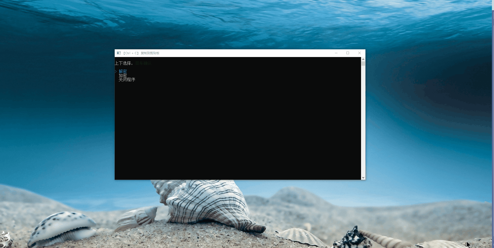

# Tool.Crypt
- 控制台加解密工具
- 运行环境 .NET 8.0
- Nuget 引用：
  - Spectre.Console
  - System.Configuration.ConfigurationManager
  - TextCopy


# 常规操作

1. 键盘按 `↑`  或者 `↓` ，选择 解密、加密、关闭程序，按 回车键选择
2. 输入要处理的文本，可按空格输入自定义密钥进行操作，不输入默认按默认密钥进行加解密
3. 使用快捷键 `Ctrl` + `C` 复制处理后的明文或密文




# 设置默认密钥

App.Config 配置 EncryKey

```xml
<appSettings>
	<add key="EncryKey" value="1122334455667788" />
</appSettings>
```


# 设置加解密方法

MainCrypt.cs 替换加解密方法
```c#
public class MainCrypt
{
    public static string Encrypt(string plainText, string key)
    {
        // 替换加密方法
    }

    public static string Decrypt(string cipherText, string key)
    {
        // 替换解密方法
    }
}
```

